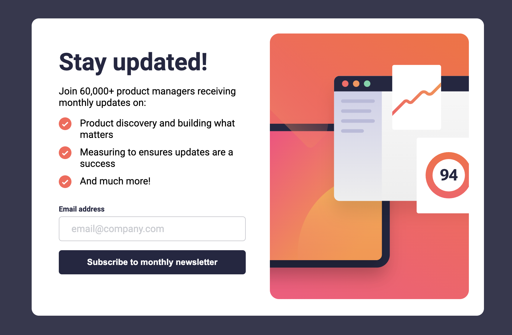
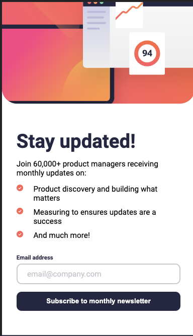
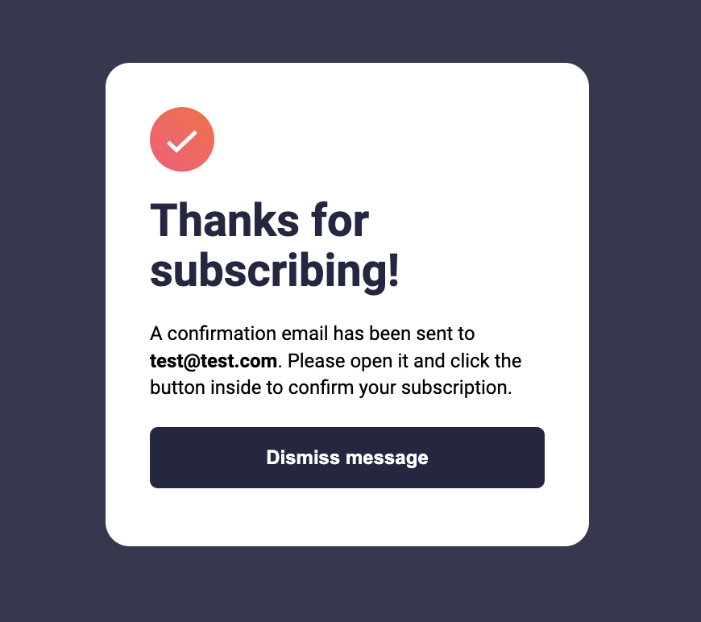
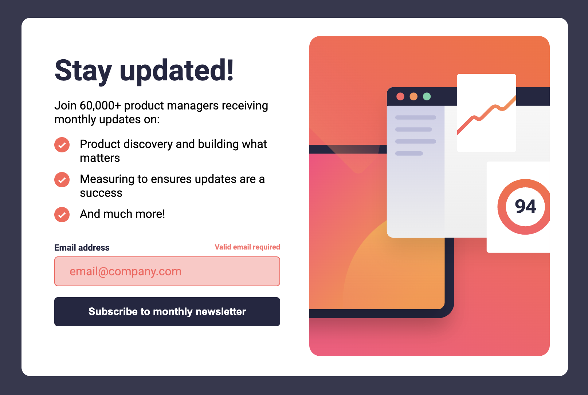

# Frontend Mentor - Newsletter sign-up form with success message solution

This is a solution to the [Newsletter sign-up form with success message challenge on Frontend Mentor](https://www.frontendmentor.io/challenges/newsletter-signup-form-with-success-message-3FC1AZbNrv). Frontend Mentor challenges help you improve your coding skills by building realistic projects.

## Table of contents

- [Overview](#overview)
  - [The challenge](#the-challenge)
  - [Screenshot](#screenshot)
  - [Links](#links)
- [My process](#my-process)
  - [Built with](#built-with)
  - [Continued development](#continued-development)
- [Author](#author)

## Overview

### The challenge

Users should be able to:

- Add their email and submit the form
- See a success message with their email after successfully submitting the form
- See form validation messages if:
  - The field is left empty
  - The email address is not formatted correctly
- View the optimal layout for the interface depending on their device's screen size
- See hover and focus states for all interactive elements on the page

### Screenshot

### Links

- Solution URL: [Add solution URL here](https://github.com/StanishCode/newsletter)
- Live Site URL: [Add live site URL here](https://stanishcode.github.io/newsletter/)

## My process

### Built with

- Semantic HTML5 markup
- CSS custom properties
- Sass
- Flexbox
- Desktop-first workflow

### Continued development

Need to further develop responsive layout designs to help minimize the amount of needed media queries. Still learning how to best use min and max dimensions with flexbox and grid so less media are required to obtain a responsive application.

I found using a CSS architecture like BEM to be useful in dividing the CSS code and isolating issues throughtout the challenge.

## Author

- Frontend Mentor - [@StanishCode](https://www.frontendmentor.io/profile/StanishCode)
